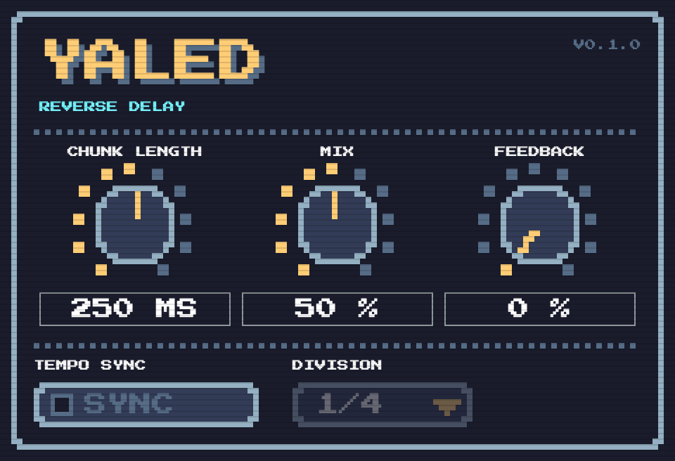

# Yaled

A reverse-delay audio plugin built with [JUCE](https://juce.com/). See [`CONTEXT.md`](./CONTEXT.md) for the domain vocabulary and [`docs/adr/`](./docs/adr/) for the reasoning behind the DSP and build-tooling decisions.



_The editor: a knob for Chunk Length, Mix and Feedback, a Tempo Sync toggle and a Division selector. With Tempo Sync on, the Chunk Length knob dims and the Division selector takes over. This animation is frames rendered from the real editor code with the parameters driven programmatically, not a screen recording of a host._

## Building

```sh
git clone --recurse-submodules <this repo>
cmake -B Builds -DCMAKE_BUILD_TYPE=Release
cmake --build Builds --config Release
```

Formats built: VST3, AU (macOS), and a Standalone app for local testing. AAX is deferred until Avid Developer Connect access is in place.

## Testing

```sh
cd Builds
ctest --verbose --output-on-failure
```

## Credits

The editor uses the Press Start 2P typeface by The Press Start 2P Project Authors, under the SIL Open Font License 1.1 ([`licenses/PressStart2P-OFL.txt`](./licenses/PressStart2P-OFL.txt)), taken from the [Google Fonts repository](https://github.com/google/fonts/tree/main/ofl/pressstart2p). The font file lives in `assets/` and is embedded in the plugin binary.
